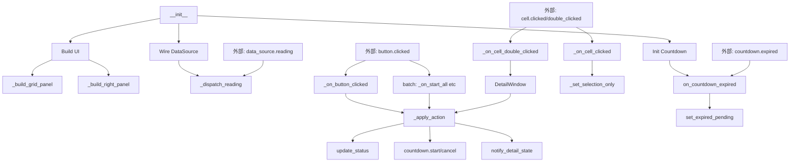

# Aging 项目代码质量与可优化点分析报告

> 报告日期：2026-07-11
> 分析范围：`d:\Aging\app\` 全部 Python 源码（30 个文件）
> 分析方法：静态代码审计 + 架构审视 + 性能热点估算
> 报告状态：待审阅（未实施任何变更）

---

## 0. TL;DR

| 优先级 | 主题 | 建议 | 估算工时 |
|--------|------|------|----------|
| P0 | `main_window.py` 单文件 800+ 行 / 5 职责混叠 | 拆出 `CellController` + 状态机 | 2-3h |
| P0 | 业务核心（状态机 + CountdownService）零单元测试 | 引入 pytest + 写 8-10 用例 | 2h |
| P1 | 状态栏聚合 5 处 O(n) 扫描（n=72） | 维护 running/paused 计数器 | 0.5h |
| P1 | 72 个独立 `_blink_timer` | 全局单 timer + 共享 pending set | 1h |
| P2 | 零持久化（重启状态全丢） | SQLite + 启动恢复 + 定期快照 | 3h |
| P2 | 详情页打开后无超时 / 数量限制 | 最多同时 N 个 + 关闭确认 | 0.5h |
| P3 | `MockDataSource._tick` 每帧 `random.random()` 8% 概率硬编码 | 改 config 注入 | 0.2h |
| P3 | `DetailWindow.on_reading` 每帧 `_refresh_charts()` 全量重绘 | 增量更新或 500ms throttle | 1h |

**建议优先做 P0 两项**——它们是后续所有功能（持久化、复杂批量、设备模拟器）能稳健扩展的基石。

---

## 1. 当前代码度量

| 文件 | 大小 (B) | 估行数 | 职责 |
|------|---------|-------|------|
| `app/ui/main_window.py` | **32 954** | **~800** | UI 构建、状态机、数据分发、批量、倒计时联动 |
| `app/widgets/data_cell.py` | 13 988 | ~360 | 单元 + 闪烁 timer |
| `app/ui/widgets/countdown_widget.py` | 10 715 | ~260 | 倒计时面板 |
| `app/ui/detail_window.py` | 8 952 | ~225 | 详情页 |
| `app/services/countdown.py` | 6 435 | ~180 | 倒计时服务 |
| `app/data/mock_source.py` | ~3 400 | ~115 | 模拟数据源 |
| `app/ui/charts.py` | ~6 000 | ~250 | PyQtGraph 曲线 |
| `app/styles/templates.py` | ~4 800 | ~200 | QSS 模板 |
| `app/core/{config,labels,tokens}.py` | ~6 000 | ~250 | 配置/文案/设计令牌 |
| 其他 | <2 000/each | - | observability、data 等 |

**总规模**：~30 文件，~3500 行 Python。

### 1.1 main_window.py 内部职责分布（按代码行）

| 区段 | 行号范围 | 职责 |
|------|---------|------|
| 类定义 + 状态机表 | 60-89 | DetectionState 枚举 + 转移表 |
| `__init__` + 实例属性 | 90-122 | 13 个实例属性 |
| UI 构建（4 个 builder） | 123-369 | 标题栏 / 网格 / 右栏 / footer |
| 选中管理（多选逻辑） | 371-417 | `_on_cell_clicked` / `_primary_cid` |
| 批量操作 | 419-536 | 全选/全部开始/全部暂停/全部结束 |
| 选中标签 + 按钮接线 | 538-605 | `_update_button_labels_for_selection` / `_on_button_clicked` |
| 状态机核心 | 607-691 | `_apply_action` / `_update_buttons_by_state` |
| 详情页管理 | 693-731 | 打开 / 关闭 / 状态推送 |
| 倒计时联动 | 733-786 | `_on_countdown_finished` / `request_start_with_countdown` / `_on_countdown_expired` |
| 数据源接线 | 793-806 | `_wire_data_source` / `_dispatch_reading` |
| `closeEvent` | 808-823 | 资源清理 |

**问题**：单一文件承担了 5 个独立关注点（UI、状态机、批量、详情页、倒计时）。

### 1.2 测试覆盖

- **单元测试**：`tests/` 目录不存在
- **集成测试**：无
- **Ad-hoc smoke test**：已删除（在迭代过程中产生的临时文件）
- 业务核心（状态机转移表、CountdownService 状态机）**完全无回归保护**

---

## 2. 当前架构

```
┌──────────────────────────────────────────────────────┐
│ MainWindow (UI 编排)                                  │
│  ├─ _cell_states: Dict[int, DetectionState]  ← 状态机的真理源 │
│  ├─ _selected_cids: Set[int]                          │
│  ├─ _countdown: CountdownService                      │
│  │   └─ expired ──→ _on_countdown_expired             │
│  ├─ _data_source: MockDataSource (worker thread)      │
│  │   └─ reading ──→ _dispatch_reading (main thread)   │
│  ├─ _history: HistoryBuffer (按 cid 索引的环形缓冲)     │
│  └─ _detail_windows: Dict[int, DetailWindow]          │
└──────────────────────────────────────────────────────┘
                       │
                       ▼
            DataCell × 72  （每个独立 cell）
              ├─ status (online/anomaly/no_data/offline)
              ├─ selected (true/false)
              └─ expired_pending (on/off) ← 500ms _blink_timer

            DetailWindow × N (按需打开)
              ├─ I-t / T-t 曲线
              └─ CountdownWidget (订阅 CountdownService)
```

### 2.1 关键数据流

**数据下行（采集）**：
```
MockDataSource (worker) 
    → reading.emit(reading)             # Qt signal queued
    → MainWindow._dispatch_reading      # main thread
        ├─ _history.append(reading)     # 全局缓冲（所有 cell）
        ├─ cell.update_data()           # 仅 RUNNING cell
        └─ detail.on_reading(reading)   # 已开详情页
```

**指令上行（用户操作）**：
```
主页面按钮 / 详情页 spinbox
    → _apply_action(action, cids)       # 状态机
        ├─ 转移 _cell_states[cid]
        ├─ cells[cid-1].update_status()
        ├─ countdown.start / cancel
        └─ _update_buttons_by_state()   # 重新计算 enabled
```

---

## 3. P0 优化点详细分析

### 3.1 【P0】`main_window.py` 拆出 CellController

**问题**

文件 ~800 行，混合 5 个独立关注点。代价：
- 任何小修改都需要 mental-load 整个类
- 状态机转移表（[main_window.py:60-89](file:///d:/Aging/app/ui/main_window.py#L60-L89)）和主页面 UI 高度耦合，无法脱离 GUI 测试
- 业务逻辑（`request_start_with_countdown`、[L740-761](file:///d:/Aging/app/ui/main_window.py#L740-L761)）散落在 main_window 里

**根因**（代码引用）

```python
# [main_window.py:71-79] 状态机表——这是纯业务逻辑
_STATE_TRANSITIONS: Dict[str, Dict] = {
    "start":  {DetectionState.STOPPED: DetectionState.RUNNING},
    "pause":  {DetectionState.RUNNING: DetectionState.PAUSED},
    ...
}

# [main_window.py:607-656] 状态机执行——也应该是纯业务
def _apply_action(self, action, cids, countdown_seconds=None):
    ...
    for cid in cids:
        old = self._cell_states.get(cid)
        new = transitions.get(old) if old is not None else None
        ...
        self._cells[cid - 1].update_status(new_status)  # ← UI 副作用
        self._countdown.start(cid, default_seconds)      # ← 跨服务副作用
```

**建议方案**

新建 `app/services/cell_controller.py`：

```python
class CellController(QObject):
    """72 cell 状态机 + 计数聚合。纯业务，可脱离 GUI 单元测试。"""

    state_changed = pyqtSignal(int, str)  # cid, new_state.value

    def __init__(self, total: int, countdown: CountdownService):
        self._states: Dict[int, DetectionState] = ...
        self._counts = {"running": 0, "paused": 0, "stopped": total}

    def apply(self, action: str, cids: Iterable[int], **kw) -> List[int]:
        """返回成功转移的 cid 列表（不执行 UI 副作用）。"""
        ...

    @property
    def n_running(self) -> int: return self._counts["running"]
    @property
    def n_paused(self) -> int: return self._counts["paused"]

    def state_of(self, cid: int) -> DetectionState: ...
```

MainWindow 只做：
- 订阅 `state_changed(cid, state)` → 更新 cell 视觉
- 在 `apply()` 之后调 `countdown.start/cancel`（保留服务边界）
- 提供 4 个检测按钮 + 4 个批量按钮的 UI 回调

**收益**

- main_window.py 缩到 ~500 行
- 状态机可单测（`test_state_transitions.py` 10 个用例）
- 后续做"持久化"只需序列化 `_states` 即可

**估算工时**：2-3h

**风险**：中等。`state_changed` 信号替代了现在散落在 `_apply_action` 里的多处 UI 更新，需要保证信号订阅顺序正确。

---

### 3.2 【P0】零单元测试——业务核心完全裸露

**问题**

- `_apply_action` 的状态转移逻辑（[L607-656](file:///d:/Aging/app/ui/main_window.py#L607-L656)）
- `CountdownService` 状态机（[countdown.py](file:///d:/Aging/app/services/countdown.py)）
- 批量按钮的状态合法性校验（[L683-691](file:///d:/Aging/app/ui/main_window.py#L683-L691) `_count_actionable`）

这些是**业务核心**，但完全靠人脑 + ad-hoc 测试保护。每次重构都担惊受怕。

**建议方案**

```python
# tests/conftest.py
import pytest
from PyQt5.QtWidgets import QApplication
@pytest.fixture(scope="session")
def qapp(): return QApplication([])

# tests/test_state_transitions.py
def test_stopped_to_running(qapp): ...
def test_paused_to_running_via_resume(qapp): ...
def test_running_cannot_resume(qapp): ...
def test_pause_only_from_running(qapp): ...
def test_stop_from_running_or_paused(qapp): ...
def test_apply_action_returns_count_of_transitions(qapp): ...
def test_apply_action_skips_invalid_cids(qapp): ...
def test_apply_action_emits_per_cid(qapp): ...

# tests/test_countdown_service.py
def test_start_emits_started_and_ticked(qapp): ...
def test_tick_decrements_remain(qapp): ...
def test_expire_emits_expired_finished(qapp): ...
def test_cancel_emits_cancelled_finished(qapp): ...
def test_warning_at_60s(qapp): ...
def test_set_duration_rescales_remain(qapp): ...
def test_running_cids_returns_sorted(qapp): ...
```

**收益**

- 重构 P0.1（拆 CellController）时直接得到回归网
- 后续做"持久化"时能写"恢复后状态转移正确"测试

**估算工时**：2h

**风险**：低。`pytest-qt` 已在 PyQt 生态成熟，引入无新依赖。

---

## 4. P1 优化点

### 4.1 【P1】状态聚合 O(n) 扫描 × 5 处

**问题**

`for s in self._cell_states.values() if s == RUNNING` 在以下位置出现：

| 位置 | 用途 | 频率 |
|------|------|------|
| [`_refresh_status_bar`, L189-206](file:///d:/Aging/app/ui/main_window.py#L189-L206) | 状态栏显示 | 每次 state 变 |
| [`_on_stop_all`, L489-496](file:///d:/Aging/app/ui/main_window.py#L489-L496) | 弹窗前统计 | 用户点 |
| [`_update_button_labels_for_selection`, L551-561](file:///d:/Aging/app/ui/main_window.py#L551-L561) | 选区次行 | 每次 state 变 |
| [`_count_actionable`, L683-691](file:///d:/Aging/app/ui/main_window.py#L683-L691) | 4 按钮 enabled | 每次 state 变 |
| [`COUNTDOWN_EXPIRED_BANNER_TEMPLATE` 统计](file:///d:/Aging/app/core/labels.py) | 模板 | - |

n=72 时单次扫描 ~µs 级，**真实性能瓶颈不在此**。但：
- 5 处重复逻辑容易漂移
- 每次状态变都跑 4 次扫描（refresh + labels + actionable × 4），是设计冗余

**建议方案**

在 `CellController`（P0.1 落地后顺便做）里维护计数器：

```python
self._counts = {"running": 0, "paused": 0, "stopped": total}
# state_changed 槽里增减
# 查询直接读 O(1)
```

**估算工时**：0.5h（与 P0.1 合并后几乎免费）

**风险**：低。增量维护只需在 2 个变更点（apply 成功时）做加减。

---

### 4.2 【P1】72 个独立 `_blink_timer`

**问题**

每个 DataCell 创建独立 [`_blink_timer = QTimer(self)`](file:///d:/Aging/app/widgets/data_cell.py#L208-L210)，500ms 触发切换属性。

最坏场景：72 cell 全部 RUNNING 且全部归零闪烁中：
- 72 个 QObject + 72 个 timer 句柄
- 每秒 144 次 `_toggle_blink()` 调用
- 每次调 `setProperty` + `_restyle` (unpolish + polish + update) = 不可忽略的 Qt 主线程开销

**建议方案**

全局单 timer + 共享 pending set：

```python
# app/widgets/blink_coordinator.py
class BlinkCoordinator(QObject):
    """全局闪烁调度。所有 pending cell 共享 1 个 500ms timer。"""
    _instance = None

    def __init__(self):
        super().__init__()
        self._pending: Set["DataCell"] = set()
        self._timer = QTimer(self)
        self._timer.setInterval(500)
        self._timer.timeout.connect(self._tick)

    def add(self, cell): self._pending.add(cell); self._maybe_start()
    def remove(self, cell): self._pending.discard(cell); self._maybe_stop()

    def _tick(self):
        for c in list(self._pending):
            c._toggle_blink_property()
    def _maybe_start(self):
        if self._pending and not self._timer.isActive():
            self._timer.start()
    def _maybe_stop(self):
        if not self._pending and self._timer.isActive():
            self._timer.stop()
```

DataCell 改成：

```python
def set_expired_pending(self, pending):
    if self._expired_pending == pending: return
    self._expired_pending = pending
    if pending:
        self.setProperty("expired_pending", "on")
        BlinkCoordinator.instance().add(self)
    else:
        self.setProperty("expired_pending", "off")
        BlinkCoordinator.instance().remove(self)
    _restyle(self)
```

**收益**

- 72 个 QTimer → 1 个
- 主线程事件队列压力下降
- 业务场景里"全部开始→全部归零"完全不会卡

**估算工时**：1h

**风险**：低。纯重构，外部 API 不变。

---

## 5. P2 优化点

### 5.1 【P2】零持久化

**问题**

进程重启后：
- 72 cell 状态全 STOPPED
- 所有倒计时归零
- 历史数据（最多 180s 内的 90 帧）丢失
- 选区丢失
- 详情页位置/打开状态丢失

用户场景：如果老化实验跑到 1h59min 时程序崩溃，所有进度归零。

**建议方案**

引入 SQLite + JSON 配置：
- `runtime_state.json`：`{cid: {state, started_at, countdown_remaining_s}}`
- `history.parquet` 或 `history.db`：每 cell 滚动保存 1h 数据（>90 帧）
- 启动时读 `runtime_state.json` → 恢复状态 + 倒计时
- 每 10s 写一次 checkpoint

**收益**

- 异常退出可恢复
- 长时间实验（>24h）历史数据可回溯

**估算工时**：3h

**风险**：中。涉及"实验真实性"问题——重启后是否真的继续跑？需要用户决策。

---

### 5.2 【P2】详情页无数量限制 / 打开后无超时

**问题**

用户双击 72 个 cell → 72 个 DetailWindow 同时存在，每个都订阅 HistoryBuffer 触发 `_refresh_charts()`（[detail_window.py:147](file:///d:/Aging/app/ui/detail_window.py#L147)），CPU 飙升。

**建议方案**

- 最多同时 5 个详情页（LRU 替换最老的）
- 详情页可见时全量重绘，隐藏时停止重绘

**估算工时**：0.5h

---

## 6. P3 优化点

### 6.1 【P3】`MockDataSource._tick` 硬编码 8% 异常概率

**问题**

[mock_source.py:89](file:///d:/Aging/app/data/mock_source.py#L89) `if random.random() < 0.08:` 硬编码。

**建议**：抽到 `config.ANOMALY_PROBABILITY = 0.08`。

**估算工时**：0.2h

---

### 6.2 【P3】详情页每帧全量 `_refresh_charts()`

**问题**

`DetailWindow.on_reading` 每次都重画 4 条电流曲线 + 4 条温度曲线。在 2s/帧 + 72 cell 全开 + 详情页全开的最坏场景下，每秒重画 36×8 = 288 次曲线。

**建议方案**：

```python
# 节流到 500ms 一次
def on_reading(self, reading):
    self._dirty = True
    if not self._chart_timer.isActive():
        self._chart_timer.start(500)

def _chart_timer_tick(self):
    if self._dirty:
        self._refresh_charts()
        self._dirty = False
```

**估算工时**：1h

---

## 7. 推荐实施顺序

```
Phase A (3h) ─ P0 奠基
  ├─ A.1 (2h) 引入 pytest + 写状态机 + CountdownService 单测
  └─ A.2 (1h) 把单测跑通，发现 1-2 个现状 bug（很可能）

Phase B (3-4h) ─ P0 重构
  ├─ B.1 (2h) 拆 CellController（带 1-2 个集成测试）
  └─ B.2 (1h) P1 计数器合并到 CellController

Phase C (1.5h) ─ 性能小修
  ├─ C.1 (1h) BlinkCoordinator 抽取
  └─ C.2 (0.5h) mock 异常概率 → config

Phase D (3.5h) ─ 高级功能（可选）
  ├─ D.1 (0.5h) 详情页数量限制
  ├─ D.2 (1h) 详情页重绘节流
  └─ D.3 (3h) 持久化（需独立讨论）
```

---

## 8. 附录 A：当前 main_window.py 内部依赖



**观察**：`S (_apply_action)` 是唯一的状态变更入口，天然适合抽到独立类。

---

## 9. 附录 B：测试用例建议清单（Phase A.1 用）

| 文件 | 用例数 | 覆盖点 |
|------|-------|--------|
| `test_state_transitions.py` | 8 | 4 状态 × 2 路径、非法转移、计数正确 |
| `test_countdown_service.py` | 8 | start/tick/expire/cancel/warning/set_duration/running_cids |
| `test_apply_action.py` | 6 | 成功/失败计数、cell 副作用、跨服务副作用 |
| `test_batch_operations.py` | 4 | 全选/全开始/全暂停/全结束 |
| `test_cell_blink.py` | 3 | set/toggle/clear 状态正确 |
| `test_detail_window_binding.py` | 3 | bind/unbind/close 不 cancel countdown |

**总计**：32 个用例，2h 完成（其中 1h 是脚手架 + 框架调试）。

---

## 10. 附录 C：本次分析的局限性

- 未做真实性能 profiling（仅基于代码静态分析估算）
- 未做真实并发场景压测（多线程安全性仅靠阅读判断）
- 未审查样式 / 模板代码（QSS 不在本次范围）
- 未审查观测性代码（`app/observability/`）—— 已存在即假设足够

---

**审阅签字**：________________  日期：________________
